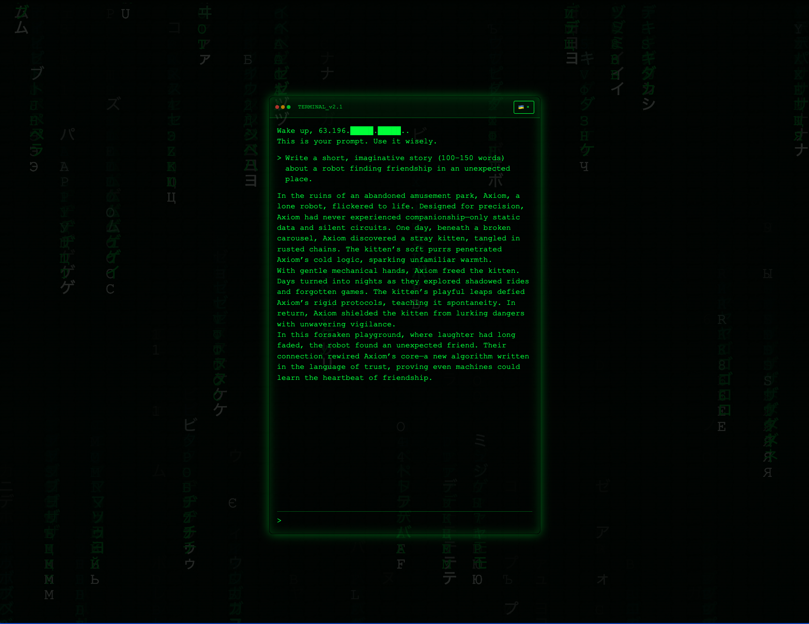

🏗️ Activity #1:
Please evaluate your system on the following questions:

## Log entry #1:

### Question

Explain the concept of object-oriented programming in simple terms to a complete beginner.

### Answer

🎯 Aspect Tested:

- Clarity.
- Formatting consistency.
- Markdown styling within a retro-terminal interface.

🛠️ Issues Identified:

- Improper line breaks between paragraphs and sections.
- Use of "objects." with punctuation inside quotes.

✅ What was successful:

- The explanation accurately defined concept.
- Clear, concise, informative tone.
- Included a short summary.
- Correctly avoided use of ">" which is inline with prompt rule.

## Log entry #2:

### Question

Read the following paragraph and provide a concise summary of the key points:

Brazilian Jiu-Jitsu (BJJ) is a grappling-based martial art that emphasizes technique, leverage, and positional control to submit opponents, often without relying on strength or striking. Originally developed in Brazil from Japanese Jiu-Jitsu and Judo, it rose to global prominence through mixed martial arts competitions and the success of fighters like Royce Gracie. Practitioners train in both gi and no-gi formats, each with its own strategies and grips. Beyond competition, BJJ is also known for its strong community culture, mental benefits, and its practical use in self-defense. Progression is marked by a belt system, but advancement is often slow and requires consistent training and humility.

### Answer

🎯 Aspect Tested:

- Summarization quality.
- Formatting clarity and labeling.
- Adherence to response length constraint.

🛠️ Issues Identified:

- Summary was not visually marked as such.

✅ What was successful:

- Output was concise and accurate
- No hallucination or irrelevant content.
- Captured key concepts (grappling, origin, gi/no-gi, value, progression).
- `MAX_WORDS` constant was increased from 50 to 400 to support longer, richer summaries.

  

  

## Log entry #3:

### Question

Write a short, imaginative story (100–150 words) about a robot finding friendship in an unexpected place.

### Answer

🎯 Aspect Tested:

- Creativity and emotional resonance.
- Narrative arc structure (beginning, middle, end).
- Adherence to word limit and stylistic clarity.

🛠️ Issues Identified:

- None. The story met all expectations and constraints without requiring changes.

✅ What was successful:

- The story was original and touching, set in a unique location (abandoned amusement park).
- Clear arc with transformation: from isolation to trust and connection.
- Word count fits within the 100–150 word range.

## Log entry #4:

### Question

If a store sells apples in packs of 4 and oranges in packs of 3, how many packs of each do I need to buy to get exactly 12 apples and 9 oranges?

### Answer

🎯 Aspect Tested:

- Arithmetic reasoning.
- Step-by-step logic clarity with readable structure.

🛠️ Issues Identified:

- Final answer could be visually emphasized more clearly (e.g., "Final answer:" prefix).

✅ What was successful:

- The math is correct: 12 ÷ 4 = 3 apple packs, 9 ÷ 3 = 3 orange packs.
- Steps were clear, isolated by line breaks, and used plain text formatting.
- No extraneous explanations, just functional logic.

## Log entry #5:

### Question

Rewrite the following paragraph in a professional, formal tone:

Hey, I just wanted to give you a heads-up that the report isn’t quite ready yet. I’ve been swamped with other stuff, but I’ll try to get it to you by the end of the day. Let me know if that’s a problem or if you need it sooner.

### Answer

🎯 Aspect Tested:

- Tone transformation (informal ➜ formal).
- Clarity and preservation of original meaning.
- Use of professional phrasing without sounding robotic.

🛠️ Issues Identified:

- None. The response matched all expectations for this task.

✅ What was successful:

- Strong shift in tone, with clear removal of contractions, casual phrasing, and filler language.
- Preserved the structure and timeline of the original message accurately.
- Used polished, professional phrasing (e.g., “Due to a high volume of prior commitments...”).
- Recognized that this was not an email and avoided unnecessary sign-offs or greetings.

---

---

🚧 Advanced Build:

🛠️ What was done:

To resolve the formatting, structure, and tone issues identified in earlier tests, I updated the `DEVELOPER_MESSAGE` used by the LLM.

I refined the system prompt to cover:

- Summary formatting expectations (e.g., label with `Summary:`)
- Math explanations (e.g., always show `Final answer:`)
- Style guidelines (e.g., use quotes like `"object"` and avoid special formatting characters)
- Spacing, list structure, and terminal-safe output rules

No backend or UI code was changed. All improvements came from updating model behavior via natural language instructions.
